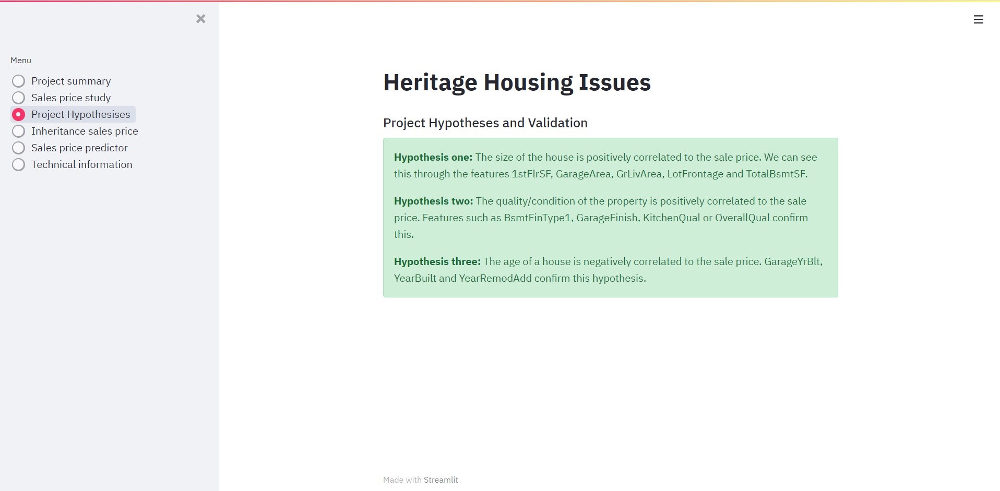
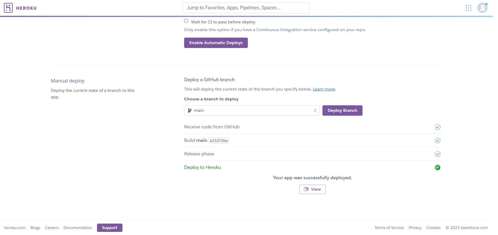

# Heritage Housing Issues

Heritage Housing Issues is a data science and machine learning project with an end goal of estimating the sale price of inherited properties. We will use a Streamlit dashboard to meet the client's expectations. We will achieve this by enabling them to visualize which features of the dataset are most closely correlated to the property price. They will also be able to estimate the sale price of the inherited property, individually and as a whole. Finally the client (and/or future customers) to manually select a house's features and estimate it's sale price.

[Live Site](https://p5hhi-aa97e2b3a3da.herokuapp.com/)

## Table of Contents

0. [Heritage Housing Issues](#about)
1. [Dataset Content](#udataset-content)
2. [Business Requirements](#business-requirements)
3. [Hypothesis and how to validate](#hypothesis-and-validation)
4. [The rationale to map the business requirements to the Data Visualisations and ML tasks](#rationale)
5. [ML Business Case](#ml-business-case)
6. [Dashboard Design](#dashboard-design)
   1. [Main page - Project summary](#project-summary)
   2. [Page two - Sales price study](#sales-price-study)
   3. [Page three - Project hypothesises](#project-hypothesises)
   4. [Page four - Inheritance sales price](#inheritance-sales-price)
   5. [Page five - Sales price predictor](#sales-price-predictor)
   6. [Page six - Technical information](#technical-information)
7. [Unfixed Bugs](#testing)
8. [Deployment](#deployment) 3. [Heroku Deployment](#heroku-deployment) 4. [Local Deployment](#local-deployment) 5. [Cloning](#cloning) 6. [Forking](#forking)
9. [Main Data Analysis and Machine Learning Libraries](#libraries)
10. [Credits](#credits) 3. [Acknowledgements](#acknowledgements)

## Dataset Content

- This project uses a dataset sourced from [Kaggle](https://www.kaggle.com/codeinstitute/housing-prices-data).
- The first part of the dataset, house_price_records, has 1460 rows and 24 columns. 23 of them represent the house profile from properties in Ames, Iowa, built between 1872 and 2010 (i.e: Floor Area, Basement, Garage, Kitchen, Lot, Porch, Wood Deck, Year Built). The last column represents the sale price for the property, this will be our target variable.

| Variable      | Meaning                                                                 | Units                                                                                                                                                                   |
| :------------ | :---------------------------------------------------------------------- | :---------------------------------------------------------------------------------------------------------------------------------------------------------------------- |
| 1stFlrSF      | First Floor square feet                                                 | 334 - 4692                                                                                                                                                              |
| 2ndFlrSF      | Second-floor square feet                                                | 0 - 2065                                                                                                                                                                |
| BedroomAbvGr  | Bedrooms above grade (does NOT include basement bedrooms)               | 0 - 8                                                                                                                                                                   |
| BsmtExposure  | Refers to walkout or garden level walls                                 | Gd: Good Exposure; Av: Average Exposure; Mn: Minimum Exposure; No: No Exposure; None: No Basement                                                                       |
| BsmtFinType1  | Rating of basement finished area                                        | GLQ: Good Living Quarters; ALQ: Average Living Quarters; BLQ: Below Average Living Quarters; Rec: Average Rec Room; LwQ: Low Quality; Unf: Unfinshed; None: No Basement |
| BsmtFinSF1    | Type 1 finished square feet                                             | 0 - 5644                                                                                                                                                                |
| BsmtUnfSF     | Unfinished square feet of basement area                                 | 0 - 2336                                                                                                                                                                |
| TotalBsmtSF   | Total square feet of basement area                                      | 0 - 6110                                                                                                                                                                |
| GarageArea    | Size of garage in square feet                                           | 0 - 1418                                                                                                                                                                |
| GarageFinish  | Interior finish of the garage                                           | Fin: Finished; RFn: Rough Finished; Unf: Unfinished; None: No Garage                                                                                                    |
| GarageYrBlt   | Year garage was built                                                   | 1900 - 2010                                                                                                                                                             |
| GrLivArea     | Above grade (ground) living area square feet                            | 334 - 5642                                                                                                                                                              |
| KitchenQual   | Kitchen quality                                                         | Ex: Excellent; Gd: Good; TA: Typical/Average; Fa: Fair; Po: Poor                                                                                                        |
| LotArea       | Lot size in square feet                                                 | 1300 - 215245                                                                                                                                                           |
| LotFrontage   | Linear feet of street connected to property                             | 21 - 313                                                                                                                                                                |
| MasVnrArea    | Masonry veneer area in square feet                                      | 0 - 1600                                                                                                                                                                |
| EnclosedPorch | Enclosed porch area in square feet                                      | 0 - 286                                                                                                                                                                 |
| OpenPorchSF   | Open porch area in square feet                                          | 0 - 547                                                                                                                                                                 |
| OverallCond   | Rates the overall condition of the house                                | 10: Very Excellent; 9: Excellent; 8: Very Good; 7: Good; 6: Above Average; 5: Average; 4: Below Average; 3: Fair; 2: Poor; 1: Very Poor                                 |
| OverallQual   | Rates the overall material and finish of the house                      | 10: Very Excellent; 9: Excellent; 8: Very Good; 7: Good; 6: Above Average; 5: Average; 4: Below Average; 3: Fair; 2: Poor; 1: Very Poor                                 |
| WoodDeckSF    | Wood deck area in square feet                                           | 0 - 736                                                                                                                                                                 |
| YearBuilt     | Original construction date                                              | 1872 - 2010                                                                                                                                                             |
| YearRemodAdd  | Remodel date (same as construction date if no remodelling or additions) | 1950 - 2010                                                                                                                                                             |
| SalePrice     | Sale Price                                                              | 34900 - 755000                                                                                                                                                          |

- The second part of the dataset, inherited_houses, has 4 rows and 23 columns. Each row represents an inherited property and the columns correspond to the house profile. The variables are consistent in name and type with We will establish a ML process to determine the sales price for each property.

## Business Requirements

As a good friend, you are requested by your friend, who has received an inheritance from a deceased great-grandfather located in Ames, Iowa, to help in maximising the sales price for the inherited properties.

Although your friend has an excellent understanding of property prices in her own state and residential area, she fears that basing her estimates for property worth on her current knowledge might lead to inaccurate appraisals. What makes a house desirable and valuable where she comes from might not be the same in Ames, Iowa. She found a public dataset with house prices for Ames, Iowa, and will provide you with that.

- 1 - The client is interested in discovering how the house attributes correlate with the sale price. Therefore, the client expects data visualisations of the correlated variables against the sale price to show that.
- 2 - The client is interested in predicting the house sale price from her four inherited houses and any other house in Ames, Iowa.

## Hypothesis and how to validate?

- We will be making hypothesises regarding the sale price of houses:
  - The size of the house is positively correlated to the sale price. The bigger the house, the more expensive it is.
  - The quality/condition of the property is positively correlated to the sale price. A pretty house is an expensive house.
  - The age of a house is negatively correlated to the sale price. The older the house/renovation, the cheaper it is.

## The rationale to map the business requirements to the Data Visualisations and ML tasks

- Business requirement 1:

  - As a customer I can access an interactive dashboard, so that I can view and understand the data presented.
  - As a customer I can easily visualize correlation between variables, so that I can understand the impact of each feature on the sale price.
  - As a customer I can view the most influential features, so that I can concentrate on the right set of features.

- Business requirement 2:
  - As a customer I can visualize the predicted sales price of my inherited properties, so that I can predict my income.
  - As a customer I can enter a house's features and immediately predict it's sales price, so that I can predict if an investment is worth it.

## ML Business Case

- This project will enable the customer to predict sales price for houses in Ames, Iowa. This will allow them to make the correct investment choices and maximise their return.

- The customer has asked us to deliver the project through a dashboard. This dashboard will include different pages to meet the business requirements while maintaining an accessible yet comprehensive content.

- In order for the customer to be satisfied and consider a successful project outcome we will have to deliver a dashboard that is accessible and gives sufficient and clear insight on the house pricing. We will also have to be able to predict a house's price, based on certain features, with a minimum of 75% accuracy according to the model.

- The inputs for this model will be the houses' features. Proper study of the data will determine if all features are relevant, and with which level of correlation. The output will be a house price, in dollars. This price is the end target of our customer, who wants this prediction to be as precise as possible as they have inherited four houses, and might want to invest more. In order to meet the first goal, we will present the price of each inherited house as well as the total of all four houses. For the second goal, we will present the predicted sale price based on the selected features.

- Business requirement 1 considers visualizing data and correlation between features. As such it can be solved using conventional data analysis. In this case we will be studying correlations through Pearson's and Spearman's correlation analysises. Running a PPS study will help us understand how useful a feature is in predicting the value of our target variable by normalizing the data. We will also be using heatmaps and plots to understand the effects of a feature on our target variable.

- In this project business requirement 2 requires an artificial inteligence solution. We will train a ML model in order to achieve this.

- Our target variable is a price in dollars. As this is a discrete variable it suggests we should use a regression model. This will be a supervised and uni-dimensional Machine Learning task.

- The criteria for the performance goal of the predictions will be it's R2 score. The R2 score is the proportion of the variance in the dependant variable that is predictablefrom the independant variable. A high value will show a high level of correlation meaning our regression model is valid. The outcome will be considered as successful if the R2 score is of at least 0.75 on train and test sets.

- There are no ethical or privacy concerns with the data used in this project as it is a public dataset. This dataset contains house prices for Ames, Iowa. There are no names, addresses or any other personal/geographical information in the database. We will consider the area (62.86 km2 with 66427 inhabitants) wide enough to not cause any privacy issues.

- In order to tackle this complex project, we will divide it into epics and user stories. An epic is a body of work that can be broken down into specific tasks (called user stories) based on the needs/requests of customers or end-users. User stories are small, self-contained units of development work designed to accomplish a specific goal within our project. These will be used in conjunction with a Kanban board and MoSCoW prioritisation to ensure an efficient, focused and timely project delivery.

## Dashboard Design

- This project is presented via a StreamLit dashboard web app. It will allow the user to easily navigate through the pages via the interactive menu on the lefthand-side of the page.

### Main page - Project summary

- The main page presents a summary of the project. This is a brief description of the project's key terms, an overview of the dataset source and contents and an insight into our business requirements.

Project summary

### Page two - Sales price study

- This page will display the results of our study of the dataset through correlation and PPS.
- It includes:
  - A sample view of our dataset
  - A graphical representation of our target variable
  - Graphical representations of the distribution of our target variable per feature
  - Heatmaps displaying correltion levels (Pearson and Spearman)
  - A heatmap showing the Predictive Power Score

Sales price study

### Page three - Project hypothesises

- Hypothesis one: the size of the house is positively correlated to the sale price.
- Validation: The correlation between features 1stFlrSF, GarageArea, GrLivArea, LotFrontage, TotalBsmtSF and SalePrice confirm this.

- Hypothesis two: the quality/condition of the property is positively correlated to the sale price.
- Validation: The correlation between features BsmtFinType1, GarageFinish,KitchenQual or OverallQual confirm this.

- Hypothesis three: the age of a house is negatively correlated to the sale price.
- Validation: The correlation between features GarageYrBlt, YearBuilt and YearRemodAdd confirm this.

Project hypothesises

### Page four - Inheritance sales price

- This page presents the prediction made for the four inherited houses. It allows the user to see the houses' most influencial features, as determined in our Modeling and Evaluation notebook. It also displays the individual predicted sales price as well as the total sales price expected.

Inheritance sales price

### Page five - Sales price predictor

- This page gives the user the opportunity to input different values for a house's features and predict it's sales price in real time.

Sales price predictor

### Page six - Technical information

- This is the technical page of the project. It presents the results of our model's perfromance and the pipeline steps.

Technical information

## Unfixed Bugs

- In the Jupyter Notebook 05 - Modeling and Evaluation, the hyperparameter optimization search and the extensive gridSearch CV cause some FutureWarnings that I have not been able to override.

FutureWarning

## Deployment

### Heroku Deployment

This project uses [Heroku](https://www.heroku.com), a platform as a service (PaaS) that enables developers to build, run, and operate applications entirely in the cloud.

Deployment steps are as follows, after account setup:

- Select **New** in the top-right corner of your Heroku Dashboard, and select **Create new app** from the dropdown menu.

New App

- Your app name must be unique, and then choose a region closest to you (EU or USA), and finally, select **Create App**.

Name choice

Deployment

Heroku needs five additional files in order to deploy properly.

- requirements.txt
- Procfile
- kaggle.json
- runtime.txt
- setup.sh

You can install this project's **requirements** (where applicable) using:

- `pip3 install -r requirements.txt`

If you have your own packages that have been installed, then the requirements file needs updated using:

- `pip3 freeze --local > requirements.txt`

The **Procfile** can be created with the following command:

- `echo web: gunicorn app_name.wsgi > Procfile`
- _replace **app_name** with the name of your primary Django app name; the folder where settings.py is located_

Runtime.txt is used to specify the python version we will be working with, in this case 3.8.17.

Setup.sh is used for streamlit app.

For Heroku deployment, follow these steps to connect your own GitHub repository to the newly created app:

Either:

- Select **Automatic Deployment** from the Heroku app.

Or:

- In the Terminal/CLI, connect to Heroku using this command: `heroku login -i`
- Set the remote for Heroku: `heroku git:remote -a app_name` (replace _app_name_ with your app name)
- After performing the standard Git `add`, `commit`, and `push` to GitHub, you can now type:
  - `git push heroku main`

The project should now be connected and deployed to Heroku!

### Local Deployment

This project can be cloned or forked in order to make a local copy on your own system.

For either method, you will need to install any applicable packages found within the _requirements.txt_ file.

- `pip3 install -r requirements.txt`.

Once the project is cloned or forked, in order to run it locally, you'll need to follow these steps:

- Start the Django app: `streamlit run app.py`
- Stop the app once it's loaded: `CTRL+C` or `⌘+C` (Mac)
- Make any necessary migrations: `python3 manage.py makemigrations`
- Migrate the data to the database: `python3 manage.py migrate`
- Create a superuser: `python3 manage.py createsuperuser`
- Load fixtures (if applicable): `python3 manage.py loaddata file-name.json` (repeat for each file)
- Everything should be ready now, so run the Django app again: `streamlit run app.py`

### Cloning

You can clone the repository by following these steps:

1. Go to the [GitHub repository](https://github.com/Corentin-Vidick/P4-JSDogTraining)
2. Locate the Code button above the list of files and click it
3. Select if you prefer to clone using HTTPS, SSH, or GitHub CLI and click the copy button to copy the URL to your clipboard
4. Open Git Bash or Terminal
5. Change the current working directory to the one where you want the cloned directory
6. In your IDE Terminal, type the following command to clone my repository:
   - `git clone https://github.com/Corentin-Vidick/P4-JSDogTraining.git`
7. Press Enter to create your local clone.

Alternatively, if using Gitpod, you can click below to create your own workspace using this repository.

Please note that in order to directly open the project in Gitpod, you need to have the browser extension installed.
A tutorial on how to do that can be found [here](https://www.gitpod.io/docs/configure/user-settings/browser-extension).

### Forking

By forking the GitHub Repository, we make a copy of the original repository on our GitHub account to view and/or make changes without affecting the original owner's repository.
You can fork this repository by using the following steps:

1. Log in to GitHub and locate the [GitHub Repository](https://github.com/Corentin-Vidick/P4-JSDogTraining)
2. At the top of the Repository (not top of page) just above the "Settings" Button on the menu, locate the "Fork" Button.
3. Once clicked, you should now have a copy of the original repository in your own GitHub account!

## Main Data Analysis and Machine Learning Libraries

### Data Cleaning

- MeanMedianImputer
- DropFeatures
- CategoricalImputer

### Feature Engineering

- OrdinalEncoder
- SmartCorrelatedSelection
- Winsorizer

### Feature Scaling

- StandardScaler

### Feature Selection

- SelectFromModel

### ML algorithms

- DecisionTreeRegressor
- XGBRegressor
- GradientBoostingRegressor, RandomForestRegressor
- LinearRegression
- AdaBoostRegressor
- ExtraTreesRegressor

## Acknowledgements

- I would like to thank the [Code Institute Slack community](https://code-institute-room.slack.com) for the moral support; it kept me going during periods of self doubt and imposter syndrome. In particular Niel McEwen for his support and technical knowledge.
- I would like to thank my partner (Anabella), for believing in me, and allowing me to make this transition into software development
